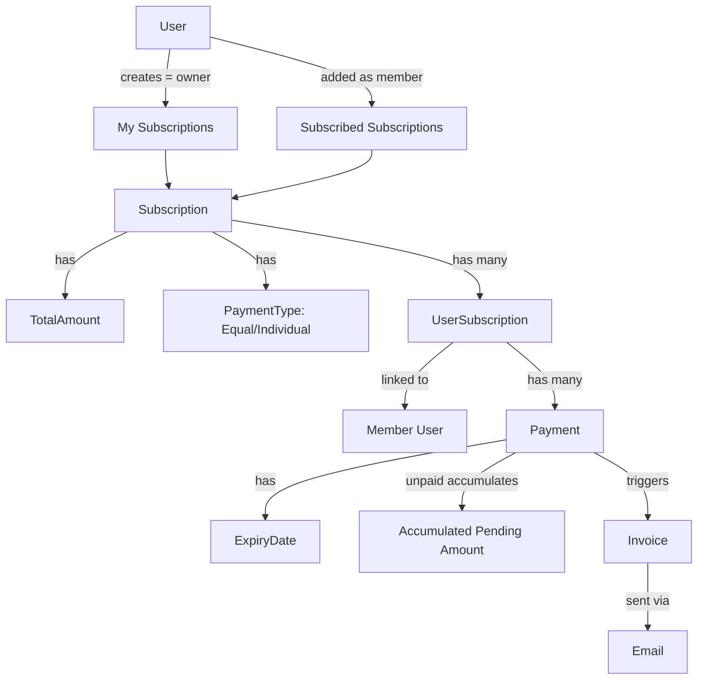
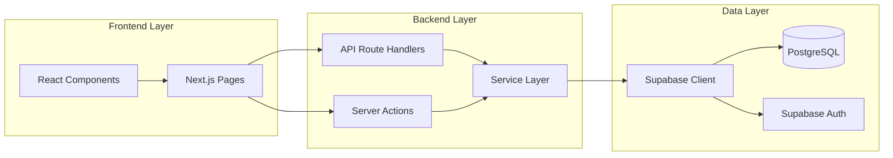
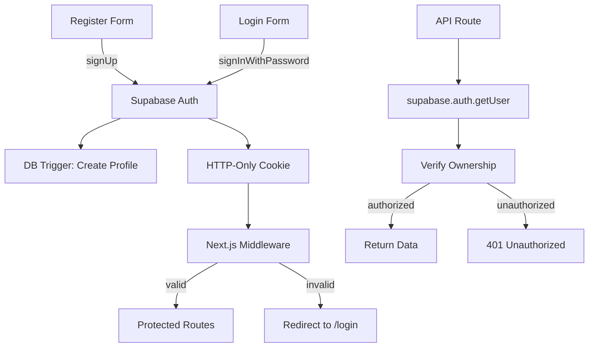

# Subscribly Implementation Plan

## Overview

Subscribly is a full-stack Next.js application for managing shared subscriptions, payment tracking, accumulated pending reports, and invoice generation. Built with Next.js 15, Supabase (PostgreSQL + Auth), and shadcn/ui for a modern, professional interface.

## Key Design Decisions

1. **Single role for everyone** - There is no Admin vs User role distinction. Every person is a "User". A user who creates a subscription is the **owner** of that subscription (tracked via `created_by`). The same user can also be a **member** of someone else's subscription.
2. **Two dashboard views**: "My Subscriptions" (subscriptions I own/created) and "Subscribed Subscriptions" (subscriptions others added me to).
3. **Accumulated pending payments** - If a member misses a month's payment, it carries forward. The report shows total accumulated unpaid amount per person across months.
4. **Invoice system** - When a payment is expired/due, the subscription owner can manually generate an invoice and email it to the member. Later, a background job will automate this.

---

## Tech Stack

- **Framework**: Next.js 15 (App Router, TypeScript, React Server Components)
- **Database**: Supabase PostgreSQL
- **Authentication**: Supabase Auth (email/password with JWT sessions)
- **UI Framework**: Tailwind CSS + shadcn/ui
- **Package Manager**: npm
- **API**: Next.js Route Handlers (RESTful endpoints for Flutter app consumption)
- **Email**: Placeholder service (Resend integration planned)
- **Build Tool**: Next.js built-in compiler (Turbopack in dev)

---

## Architecture Overview



### Application Layers



---

## Project Structure

```
Subscribly/
  Makefile                      # Project automation (make dev, make stop, etc.)
  README.md                     # Comprehensive open-source project documentation
  LICENSE                       # Project license
  .gitignore                    # Git ignore patterns
  docs/
    initialplan.md              # This file - implementation plan
    requirements.md             # Feature specifications
    supabase-schema.sql         # Database schema and migrations
  src/                          # Next.js project root
    .env.example                # Environment variables template
    .env.local                  # Local environment variables (gitignored)
    package.json
    tsconfig.json
    next.config.ts
    tailwind.config.ts
    components.json             # shadcn/ui configuration
    middleware.ts               # Auth middleware (session refresh, route protection)
    app/
      layout.tsx                # Root layout
      page.tsx                  # Landing page (redirects to dashboard)
      (auth)/                   # Auth route group (no auth layout)
        login/page.tsx
        register/page.tsx
      (dashboard)/              # Dashboard route group (protected layout)
        layout.tsx              # Sidebar + header layout
        dashboard/page.tsx      # Main dashboard
        subscriptions/
          page.tsx              # List all subscriptions
          new/page.tsx          # Create subscription
          [id]/page.tsx         # Subscription detail
        payments/page.tsx       # Payment listing
        invoices/
          page.tsx              # Invoice listing
          [id]/page.tsx         # Invoice detail
        reports/
          pending/page.tsx      # Accumulated pending report
      api/                      # API routes (REST endpoints)
        auth/
          callback/route.ts     # Supabase auth callback
        subscriptions/
          route.ts              # GET/POST /api/subscriptions
          [id]/route.ts         # GET/PUT/DELETE /api/subscriptions/:id
          [id]/members/route.ts # GET/POST /api/subscriptions/:id/members
        payments/
          route.ts              # GET/POST /api/payments
          [id]/mark-paid/route.ts
        invoices/
          route.ts              # GET/POST /api/invoices
          [id]/route.ts         # GET /api/invoices/:id
          [id]/send/route.ts    # POST /api/invoices/:id/send
        reports/
          pending/route.ts      # GET /api/reports/pending
    components/
      ui/                       # shadcn/ui components
        button.tsx
        card.tsx
        input.tsx
        table.tsx
        dialog.tsx
        tabs.tsx
        (etc.)
      layout/
        sidebar.tsx             # App sidebar navigation
        header.tsx              # App header with user menu
        mobile-nav.tsx          # Mobile navigation
      subscriptions/
        subscription-card.tsx   # Subscription display card
        subscription-form.tsx   # Create/edit subscription form
        member-list.tsx         # Member list table
        add-member-dialog.tsx   # Add member modal
      payments/
        payment-table.tsx       # Payment history table
        pending-report.tsx      # Accumulated pending display
        mark-paid-button.tsx    # Mark as paid action
      invoices/
        invoice-detail.tsx      # Invoice display/print view
        invoice-form.tsx        # Generate invoice form
    lib/
      supabase/
        client.ts               # Browser Supabase client
        server.ts               # Server-side Supabase client
        middleware.ts           # Auth middleware helper
      services/
        subscription-service.ts
        user-subscription-service.ts
        payment-service.ts
        invoice-service.ts
        email-service.ts        # Placeholder email service
      types/
        database.ts             # Supabase generated types
        index.ts                # App-level types, enums, DTOs
      utils.ts                  # Utility functions
      constants.ts              # App constants
```

---

## Database Schema (Supabase PostgreSQL)

### Tables

#### profiles
Extends `auth.users` from Supabase Auth.

| Column | Type | Description |
|--------|------|-------------|
| id | UUID | Primary key, FK to auth.users(id) |
| full_name | TEXT | User's full name |
| phone_number | TEXT | Phone number for invoicing |
| avatar_url | TEXT | Profile avatar URL |
| created_at | TIMESTAMPTZ | Account creation timestamp |
| updated_at | TIMESTAMPTZ | Last update timestamp |

#### subscriptions
Subscription services (Netflix, Spotify, etc.).

| Column | Type | Description |
|--------|------|-------------|
| id | UUID | Primary key |
| name | TEXT | Subscription name |
| icon | TEXT | Icon/emoji or URL |
| description | TEXT | Optional description |
| total_amount | DECIMAL(18,2) | Total monthly cost |
| payment_type | TEXT | 'equal' or 'individual' |
| total_members | INT | Number of members |
| created_by | UUID | FK to profiles(id) - owner |
| is_active | BOOLEAN | Active status |
| created_at | TIMESTAMPTZ | Creation timestamp |
| updated_at | TIMESTAMPTZ | Last update timestamp |

#### user_subscriptions
Links users to subscriptions as members.

| Column | Type | Description |
|--------|------|-------------|
| id | UUID | Primary key |
| subscription_id | UUID | FK to subscriptions(id) |
| subscriber_user_id | UUID | FK to profiles(id) |
| amount | DECIMAL(18,2) | Individual payment amount |
| expiry_date | TIMESTAMPTZ | Current cycle expiry |
| is_active | BOOLEAN | Active membership status |
| created_at | TIMESTAMPTZ | Membership start date |

#### payments
Individual payment records per member per cycle.

| Column | Type | Description |
|--------|------|-------------|
| id | UUID | Primary key |
| user_subscription_id | UUID | FK to user_subscriptions(id) |
| amount | DECIMAL(18,2) | Payment amount |
| is_paid | BOOLEAN | Payment status |
| paid_on | TIMESTAMPTZ | Payment date (if paid) |
| expiry_date | TIMESTAMPTZ | When this payment expires |
| created_at | TIMESTAMPTZ | Payment creation date |
| created_by | UUID | FK to profiles(id) |

#### invoices
Generated invoices for unpaid amounts.

| Column | Type | Description |
|--------|------|-------------|
| id | UUID | Primary key |
| user_subscription_id | UUID | FK to user_subscriptions(id) |
| issued_to_user_id | UUID | FK to profiles(id) |
| total_amount | DECIMAL(18,2) | Total accumulated amount |
| months_covered | TEXT | e.g., "Jan 2026, Feb 2026" |
| status | TEXT | 'generated', 'sent', 'paid' |
| sent_on | TIMESTAMPTZ | Email sent timestamp |
| paid_on | TIMESTAMPTZ | Payment received timestamp |
| created_at | TIMESTAMPTZ | Invoice creation date |
| created_by | UUID | FK to profiles(id) - owner |

### Row Level Security (RLS)

All tables have RLS enabled. Users can only:
- Read/write subscriptions they own (created_by = auth.uid())
- Read/write subscriptions they're members of (via user_subscriptions)
- Read/write their own profile
- Owners can manage payments/invoices for their subscriptions

### Database Functions (RPC)

- **get_my_subscriptions(p_user_id UUID)** - Returns subscriptions where created_by = user
- **get_subscribed_subscriptions(p_user_id UUID)** - Returns subscriptions where user is a member
- **get_accumulated_pending(p_subscription_id UUID)** - Returns accumulated unpaid amounts per member
- **get_accumulated_pending_by_owner(p_owner_id UUID)** - Returns pending across all owned subscriptions

---

## Authentication & Authorization

### Supabase Auth Flow



### Implementation

1. **Registration**: User signs up with email/password → Supabase creates auth.users record → Database trigger creates profiles record
2. **Login**: User signs in → Supabase returns session → Stored as HTTP-only cookie via Supabase SSR helpers
3. **Middleware**: Next.js middleware checks session on every request to `/dashboard/*` routes
4. **API Protection**: Each API route calls `supabase.auth.getUser()` and verifies:
   - User owns the resource (created_by = user.id)
   - OR user is a member of the resource (via user_subscriptions join)
5. **No role-based access**: Ownership is contextual, not role-based

---

## Key Features

### 1. Subscription Management

**My Subscriptions** - Subscriptions the user owns/created
- Create new subscription (name, icon, total amount, payment type)
- Add/remove members
- Set payment amounts (equal split or individual)
- View member payment status
- Deactivate subscription

**Subscribed Subscriptions** - Subscriptions user is a member of
- View subscription details (name, owner, my amount)
- See payment status and history
- Receive invoices when payments are overdue

### 2. Payment Tracking

- Automatic payment record creation per cycle
- **Equal split**: Total amount / number of members
- **Individual split**: Custom amount per member
- Mark payments as paid (owner only)
- Payment history per subscription
- Payment expiry tracking

### 3. Accumulated Pending Payments

When a member misses a payment, the amount accumulates:
- Unpaid payments carry forward across months
- Dashboard shows total accumulated pending per subscription
- Pending report shows per-member breakdown:
  - Name, email, phone
  - Months unpaid (e.g., "Jan 2026, Feb 2026")
  - Total accumulated amount

### 4. Invoice Generation

Subscription owners can generate invoices for unpaid amounts:
1. Select a member with unpaid payments
2. Select which months to include in invoice
3. System generates invoice with:
   - Subscription details
   - Member information
   - Amount breakdown by month
   - Total accumulated amount
4. Invoice can be sent via email (placeholder service)
5. Invoice tracking (generated → sent → paid)

### 5. Dashboard & Reports

- **Main Dashboard**: Overview of owned and subscribed subscriptions
- **Subscription Detail**: Full member list with payment status
- **Pending Report**: Accumulated pending across all owned subscriptions
- **Invoice History**: All generated invoices

---

## API Endpoints (REST)

All API routes return JSON and follow REST conventions. Designed for consumption by both the Next.js frontend and future Flutter mobile app.

### Subscriptions

| Method | Endpoint | Description | Auth |
|--------|----------|-------------|------|
| GET | `/api/subscriptions` | List user's subscriptions (owned + member) | Required |
| POST | `/api/subscriptions` | Create new subscription | Required |
| GET | `/api/subscriptions/:id` | Get subscription details | Owner/Member |
| PUT | `/api/subscriptions/:id` | Update subscription | Owner only |
| DELETE | `/api/subscriptions/:id` | Delete subscription | Owner only |
| GET | `/api/subscriptions/:id/members` | List subscription members | Owner/Member |
| POST | `/api/subscriptions/:id/members` | Add member to subscription | Owner only |
| DELETE | `/api/subscriptions/:id/members/:memberId` | Remove member | Owner only |

### Payments

| Method | Endpoint | Description | Auth |
|--------|----------|-------------|------|
| GET | `/api/payments` | List payments (filtered by query params) | Required |
| POST | `/api/payments` | Create payment record | Owner only |
| POST | `/api/payments/:id/mark-paid` | Mark payment as paid | Owner only |

### Invoices

| Method | Endpoint | Description | Auth |
|--------|----------|-------------|------|
| GET | `/api/invoices` | List invoices | Required |
| POST | `/api/invoices` | Generate invoice | Owner only |
| GET | `/api/invoices/:id` | Get invoice details | Owner/Recipient |
| POST | `/api/invoices/:id/send` | Send invoice via email | Owner only |

### Reports

| Method | Endpoint | Description | Auth |
|--------|----------|-------------|------|
| GET | `/api/reports/pending` | Accumulated pending report | Owner only |

---

## UI Components & Design

### Design Principles

- **Simple & Professional**: Clean, minimal interface using shadcn/ui components
- **Responsive**: Mobile-first design with sidebar on desktop, bottom nav on mobile
- **Accessible**: Proper ARIA labels, keyboard navigation, screen reader support
- **Dark Mode**: Support for light/dark theme switching
- **Performance**: Server-side rendering, optimistic updates, loading states

### Key Pages

1. **Login/Register**: Clean auth forms with validation
2. **Dashboard**: Card-based layout with tabs for "My Subscriptions" vs "Subscribed"
3. **Subscription Detail**: Table showing members, amounts, payment status, actions
4. **Create Subscription**: Multi-step form (details → add members → set amounts)
5. **Pending Report**: Sortable data table with filters and summary totals
6. **Invoice View**: Print-friendly layout with all invoice details

---

## Future Enhancements

### Background Job (Planned)

Automated invoice generation using Supabase Edge Functions or pg_cron:
- Runs every 15 minutes
- Checks for expired payments (expiry_date < now AND is_paid = false)
- Auto-generates invoice for each expired payment
- Sends invoice email to member
- Updates invoice status to 'sent'

### Email Integration (Planned)

Replace placeholder email service with Resend or SendGrid:
- Professional email templates
- Invoice PDF attachment
- Email tracking (opened, clicked)

### Payment Integration (Future)

Integrate payment gateway (Stripe, PayPal):
- Members can pay invoices directly via link
- Automatic payment status updates
- Payment receipts

### Flutter Mobile App (Planned)

Native mobile app consuming the same Next.js API routes:
- View subscriptions
- Pay invoices
- Push notifications for new invoices
- Mobile-optimized UI

---

## Development Workflow

### Prerequisites

- Node.js 18+ and npm
- Git
- Supabase account (free tier available)
- Make (optional, for automation)

### Setup

```bash
# Clone repository
git clone <repo-url>
cd Subscribly

# First-time setup (copies .env.example to .env.local)
make setup

# Edit src/.env.local with your Supabase credentials
# NEXT_PUBLIC_SUPABASE_URL=your-project-url
# NEXT_PUBLIC_SUPABASE_ANON_KEY=your-anon-key

# Install dependencies
make install

# Create Supabase project and run docs/supabase-schema.sql

# Start development server
make dev

# Stop server
make stop
```

### Make Commands

| Command | Description |
|---------|-------------|
| `make help` | List all available commands (default) |
| `make setup` | Copy .env.example to .env.local |
| `make install` | Install npm dependencies |
| `make dev` | Start dev server (background) |
| `make build` | Build for production |
| `make start` | Start production server (background) |
| `make stop` | Stop running server |
| `make clean` | Remove node_modules, .next, out |
| `make lint` | Run ESLint |
| `make format` | Run Prettier |

---

## Contributing

Subscribly is an open-source project. Contributions are welcome!

1. Fork the repository
2. Create a feature branch (`git checkout -b feature/amazing-feature`)
3. Commit your changes (`git commit -m 'Add amazing feature'`)
4. Push to the branch (`git push origin feature/amazing-feature`)
5. Open a Pull Request

---

## License

See LICENSE file in the repository root.

---

## Support

For questions, issues, or feature requests, please open an issue on GitHub.
